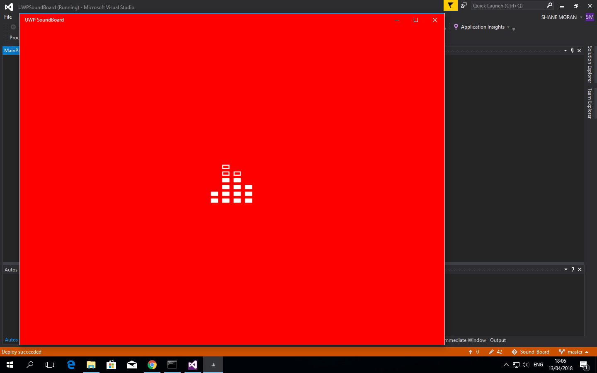
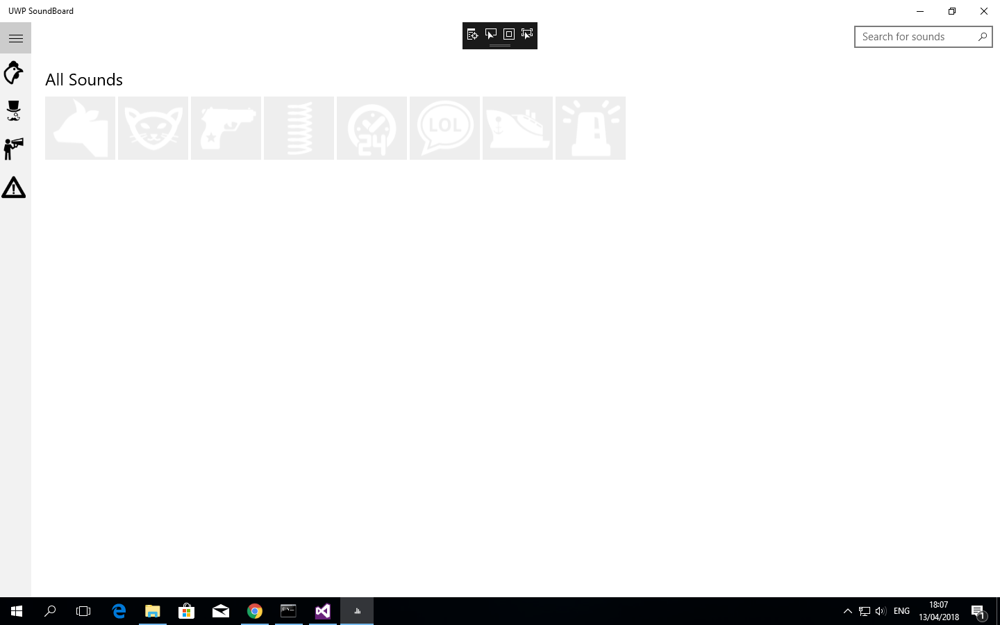
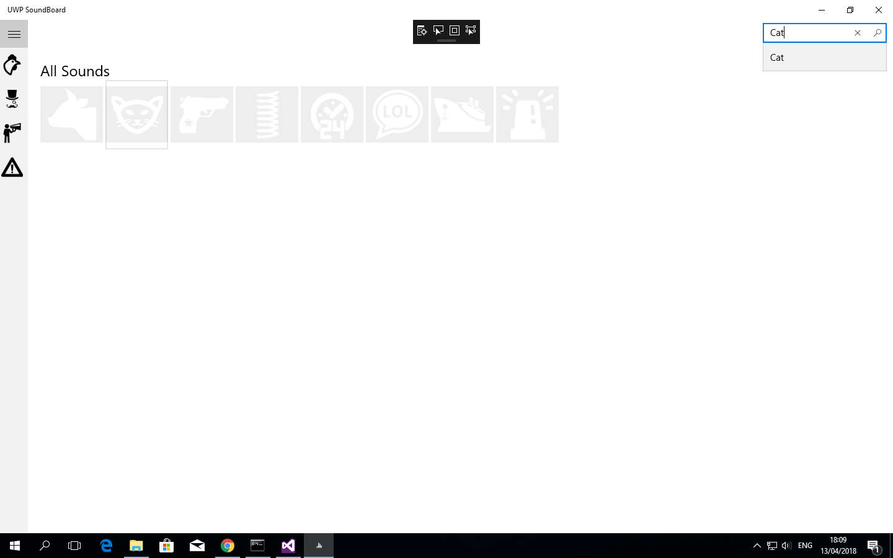
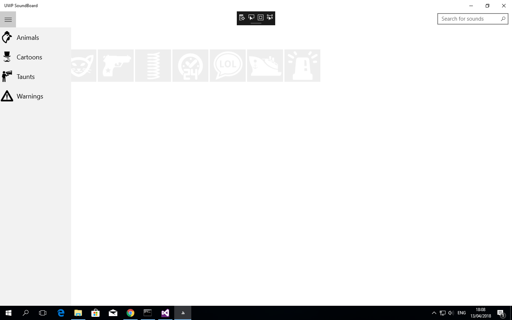

# Sound-Board
Universal Windows Platform (UWP) app demonstrating real-world sounds. Using this app, you can play various sounds at the tip of your finger.

## What does the Sound-Board feature ...

It allows users to:
- Play various sounds 
- Search for sounds

## Requirements
- Well-designed UI that is fit for purpose and provides a good user experience.

- Uses local/roaming storage for storing data and/or settings that are necessary for or enhance this user experience.

- Demonstrates appropriate use of the sensors/hardware available on UWP capable devices (Accelerometer, gyroscope, location services, sound, network service (connect to server for data), camera, multi touch gestures)

- More than a simple information app and be interactive as part of the design

## How to Run / Get Started
For instructions on setting up , see [Getting started with Visual Studio](https://www.visualstudio.com/vs/getting-started/).

## Submission
- Github repository link for the project
- Publisher name
- App name and public link on the Windows Store
- **Make sure this is the public link or you will be penalised**
